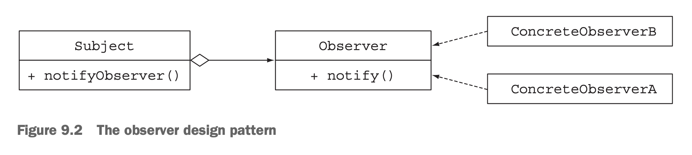
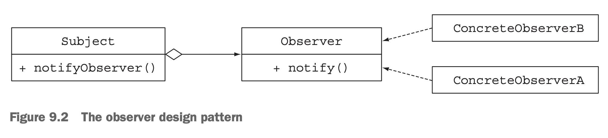
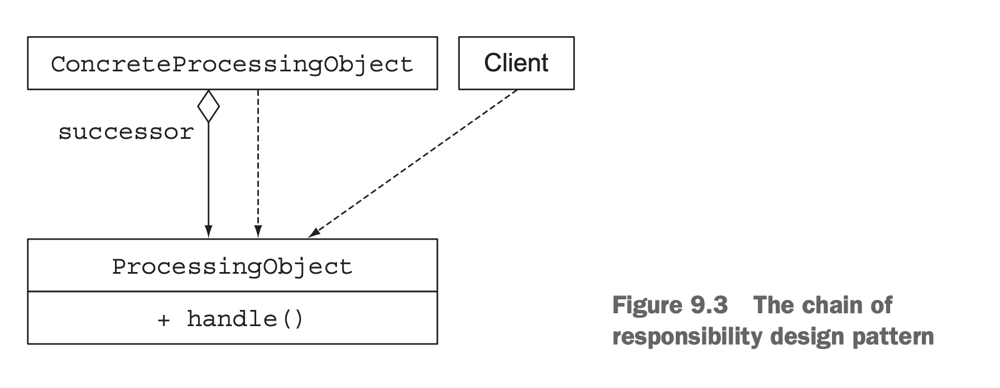

# 9장 리팩토링, 테스팅, 디버깅

# 1. 리팩토링 : 가독성 유연성 개선

## 가독성 개선

* 우리가 구현한 코드를 다른 사람이 쉽게 이해하고 유지보수 할 수 있게 만드는 작업
* 코드의 문서화
* 표준 코딩 규칙 준수

```
  익명 클래스 -> 람다 함수(표현식) -> 메서드 참조
  기존 for, while -> stream api
```

#### 1) 익명 클래스를 람다 표현식으로

* 익명 클래스로 구현할 때의 문제점 -> 람다로 해결
  * 코드가 장황하고 불필요한 작업을 해야 한다.
  * 에러 코드를 양산할 가능성이 높다.
  
* 람다 표현식의 문제점
  * this 가 가르키는 대상이 다르다.
  * 지연 변수 값을 변경할 수 없다.
    * [my] 변수를 객체로 만들면 참조 및 변경이 가능하다. 
    * [my] 하지만 이렇게 사용하는 것은, 코드를 스파케티 코드로 만들 가능성이 있다.
  * 인자로 넘어올 함수 타입이 모호할 수 있다.
    * IntelliJ와 같은 툴을 쓰면 해결이 된다.

#### 2) 람다 표현식을 메소드 참조로

* 람다 보다는 메서드 참조가 코드의 의도를 더 명확하게 보여주기 때문에 가독성을 높여준다.
* 내장 컬렉터를 사용하면 코드 자체로 가독성을 더 높일 수 있다. (naming 에 자신이 있나 봄...)
  * ```java
    int totalCalories = menu.stream().collect(summingInt(Dish::getCalories));
    ```


#### 3) 명령형 데이터 처리를 스트림으로
* 스트림 API는 데이터 처리 파이프라인의 의도를 더 명확하게(간결하게) 보여준다.
  * short circuiting 이나 lazy evaluation, parallel 의 이득을 덤으로 얻을 수 있다.
* 예전 코드 : 필터링과 추출이 엉킨 코드이다.
  ```java
    List<String> dishNames = new ArrayList<>();
    for(Dish dish: dishes){
      if(dish.getCalories() > 300){
        dishNames.add(dish.getName());
      }
    }
  ```

* 스트림 API : 가독성이 좋아지고 병렬 처리를 추가할 수 있다.
  ```java
    menu.parallelStream()
        .filter(d->d.getCalories() > 300)
        .map(Dish::getName())
        .collect(toList());
  ```

---
## 유연성 개선

```
목적 : 변화하는 요구사항에 대응할 수 있는 코드 구현
```

### 방법 1) 조건부 연기 실행
* 보안이나 로깅 처리 같은 코드는 코드 내부에 흐름이 복잡하게 얽히게 된다.
  * [my] 그래서 annotation 을 쓰거나 
  * [my] AOP(Aspect Oriented Programming) 기법의 코딩을 한다.
* 코드
  ```java
  if (logger.isLoggable(Log.FINER)) {
    logger.finer("Problem: " + generateDiagnostic());
  }
  ```
  - (1) logger의 상태가 isLoggable 이라는 메서드에 의해 클라이언트 코드로 노출된다.
  - (2) 메시지를 로깅할 때마다 logger 객체의 상태를 확인해야 한다.

* 내부적으로 상태를 체크하는 방법을 쓰는 것이 바람직하다. (1, 2번 해결)
  ```java
  logger.log(Level.FINER, "Problem: " + generateDiagnostic());
  ``` 
  - 새로운 문제 : 인자로 넘길 String 객체를 매번 만들어야 한다 (프로세스 낭비)
* java8 에서는 log4j 에 새로운 메서드가 추가되었다.
  ```java
    public void log(Level level, Supplier<String> msgSupplier)
  ```
  다음과 같이 코드를 변경할 수 있다.
  ```java
   logger.log(Level.FINER, ()->"Problem: "+generateDiagnostic());
  ```
  * [의문점] : 이렇게 하면 동적 실행시 마다 람다를 매번 생성해서 넘겨야 하는게 아닐까?
    * 람다함수(내부적으로는 람다 표현식을 구현한 클래스)는 해당 람다 함수를 소유한 클래스\$함수명\$orderNumer 형식의 내부 익명클래스가 생성되고 구현코드는 해당 클래스의 인스턴스(? 혹은 싱글톤) 를 만들어서 (왜냐하면 컨텍스트 변수들에 대한 참조 스택을 넘겨줘야 하기 때문에) 넘어가는 것 같다.(? 확인하지는 못했음)
    * 그렇더라도 람다의 인스턴스를 만들어서 넘기는 비용이 크지 않을까?
  * 해당 객체에 메서드를 만들고 메서드 참조를 넘기는 것이 바람직하다.
  ```java
   logger.log(Level.FINER, SomeObject::printDiagnostic)
  ```


### 방법 2) 실행 어라운드
* 매번 같은 준비과정과 종료과정이 필요한 경우 실행 어라운드 패턴을 사용한다.
  ```java
  public class RunAroundExample {

    private static final String FILE = RunAroundExample.class.getResource("./data.txt").getFile();

    public static void main(String[] args) throws IOException {
        String[] oneLine = processFile(br->new String[]{br.readLine()});
        String[] twoLine = processFile(br->new String[]{br.readLine(), br.readLine()});
    }

    public static String[] processFile(BufferedReaderProcessor p) throws IOException {
        try (BufferedReader br = new BufferedReader(new FileReader(FILE))) {
            return p.process(br);
        }
    }

    public interface BufferedReaderProcessor {
        String[] process(BufferedReader b) throws IOException;
    }
  }
  ```


### 추가 의견 
* [my] annotation 핸들링의 편리함
  * 클래스나 메서드에 annotation 을 복수로 설정할 수 있기 때문에 클래스 혹은 메서드에서 어노테이션을 체크 하고 처리하는 코딩(reflection coding)이 좀 불편했는데, 이런 메타코딩이 (확실히) 편리해 졌다.
* [my] interface 선언만으로도 AOP 스러운 효과를 낼 수 있다. (default 메서드 추가)
* [my] 타입 추론 => 설계 관점에서 추상화할 수 있는 기법들이 매우 다양해 졌다.


---
# 2. 디자인 패턴 리팩토링

* 언어의 새로운 기능이 추가되면 기존 코드의 관용코드가 새로운 코드로 대체된다.
  * java5 에 도입된 for-each 루프는 에러 발생률이 적으며 간결해서 인기를 누렸다.
  * java7 의 <> 연산자는 형식 추론의 길을 열었다.
  * [my] annotation 이 도입되면서 generic 코드가 할 수 있는 영역을 확장했다.
  * [my] interface의 default 메서드 지원은 인터페이스의 품격을 한단계 업그레이드 했다. (진작에 있었으면 많은 디자인 패턴이 나오지도 않았을 것이다.)

* 마찬기지로 디자인 패턴도 새로운 람다와 stream api 를 통해 새로운 코드들로 대체되고 있다.
  
### Strategy
* 하나의 알고리즘을 보유한 상태에서 런타임에 대체 가능한 적절한 알고리즘을 선택해서 실행하는 기법
* 
* 코드 : Validator

### Template
* 알고리즘의 개요를 제시한 다음, 알고리즘의 일부를 고칠 수 있는 유연함을 제공해야 할 때 사용.
* 알고리즘의 일부를 고쳐서 사용할 수 있도록 여지를 주는 코딩 방식
* 코드 : 온라인 뱅킹 애플리케이션 예제

### Observer
* 어떤 이벤트가 발생했을 때, 한 객체가 다른 객체 리스트에 자동으로 알림을 보내야 하는 상황에서 사용하는 패턴.
* 
* 코드 : Observer

### Chain of Responsibility
* 작업 처리 객체의 체인을 만들 때 사용하는 패턴 
* 
* 코드 

### 팩토리
* 인스턴스화 로직을 클라이언트에 노출하지 않고 객체를 만들 때 사용하는 패턴
* [my] 객체 생성 방법을 제한하기 위한 목적으로 사용한다.
* [my] 생성자를 private 으로 감추고, static 메서드를 이용해 생성한다.
* 코드 

# 3. 테스팅

일반적인 테스트 코드
```java
  public class Point {

    private int x;
    private int y;

    private Point(int x, int y) {
      this.x = x;
      this.y = y;
    }

    public int getX() {return x;}
    public int getY() {return y;}
    public void setX(int x) {this.x = x;}
    public void setY(int y) {this.y = y;}
    public Point moveRightBy(int x){ return new Point(this.x+x, this.y);}
  }

  @DisplayName("(5,5)를 오른쪽으로 10칸 움직이면 (15,5)가 된다.")
  @Test
  public void testMoveRightBy() throws Exception {
    Point p1 = new Point(5,5);
    Point p2 = p1.moveRightBy(10);
    assertEquals(15, p2.getX());
    assertEquals(5, p2.getY());
  }

```

### 1) Lambda 함수를 공개하고 테스트 하기

* 람다 함수 자체는 익명함수이기 때문에 외부에서 람다함수만 공개적으로 테스트를 걸 수 없다.
* 따라서 람다 함수 자체를 공개해서 선언하고 테스트하는 방법을 사용해 볼 수 있다.
```java
  public class Point {

    private int x;
    private int y;

    private Point(int x, int y) {
      this.x = x;
      this.y = y;
    }

    public int getX() {return x;}
    public int getY() {return y;}

    public final static Comparator<Point> compareByXAndThenY =
            comparing(Point::getX).thenComparing(Point::getY);
  }

  @DisplayName("public static 람다식을 테스트 하기")
  @Test
  public void testComparingTwoPoints() throws Exception {
    Point p1 = new Point(10, 15);
    Point p2 = new Point(10, 20);
    assertTrue(Point.compareByXAndThenY.compare(p1, p2) < 0);
    assertTrue(Point.compareByXAndThenY.compare(p2, p1) > 0);
  }
```
 - compareByXAndThenY 함수가 Comparator 를 리턴한다.
 - public 으로 공개한 함수이기 때문에 테스트 테스트가 용이하다.

### 2) Lambda 함수를 사용하는 메서드 테스트

* 하지만 람다함수를 공개하는 것보다는 람다함수를 사용하는 함수를 테스트하는 것이 더 자연스럽고 일반적이다.(캡슐화나 가독성 면에서)
  ```java
  class Point {
    ...
  
    @Override
    public boolean equals(Object o) {
      if (this == o) return true;
      if (o == null || getClass() != o.getClass()) return false;
      Point point = (Point) o;
      return x == point.x &&
              y == point.y;
    }
    
    public static List<Point> moveAllPointsRightBy(List<Point> points, int x){
      return points.stream().map(p->new Point(p.getX()+x, p.getY())).collect(toList());
    }
  }

  @DisplayName("람다를 포함한 함수를 테스트 하기")
  @Test
  public void testMoveAllPointsRightBy() {
    List<Point> points = List.of(new Point(5,5), new Point(10,5));
    List<Point> expects = List.of(new Point(15,5), new Point(20,5));
    List<Point> moves = Point.moveAllPointsRightBy(points, 10);
    assertEquals(expects, moves);
  }
  ```

### 람다를 개별 메서드로 분할하기

* 람다식을 사용할 때, 람다안의 표현식을 메서드 참조로 사용해서 메서드를 테스트한다면 람다식 자체에 대한 테스트 부담을 다소 줄일 수 있을 것이다.

### (High Order Function) 고차원 함수 테스팅

* 고차원 함수는 람다 함수를 인수로 받아서 처리하거나, 인자를 받아 처리할 함수를 반환하기 때문에 사용하기가 좀 더 까다롭다.
* 하지만, 람다를 사용해 함수를 만들어 넘겨서 테스트 하거나
* 반환받은 함수에 안자를 넣어 테스트 하면 된다.

#### 추가 의견
* [my] 고차원 함수는 javascript 에서 더 쉽게 접할 수 있다.
  ```javascript
  const makeNewVar = name => (arg) => {
    let newVar = arg + ':'+ name;
    return newVar;
  }
  ```
* [my] junit5 (jupiter) 와 spring boot2 에서 유닛테스트 기법들이 상당히 많이 좋아졌다. 
* [my] 테스트 주도 개발(TDD)은 쉽지 않다. 
  * 개인적인 생각이지만, 테스트 개발은 본 시스템 개발과 별개로 하나의 큰 프로젝트이다.
  * 테스트를 자동화 한다는 것은 본 시스템의 성격이나 처한 상황에 따라 다양한 기법과 방법이 동원될 수 있다. 
  * 만약 사용 시나리오와 데이터 테스트가 중요하다면 큐컴버도 하나의 좋은 툴이 될 수 있다고 생각한다.

# 4. 디버깅

### stack trace 확인하기
  * 람다 표현식은 이름이 없기 때문에 ...lambda\$main\$0 같은 이름으로 스택 트레이스 로그가 찍힌다.
    * 메서드 참조를 쓰더라도 메서드 이름이 제대로 찍히지 않는다.
    * 다만, 실행코드와 같은 클래스에 있는 메서드를 참조한 경우에는 메서드 이름이 찍힌다.
  * 미래의 자바 컴파일러가 점차 개선해야 할 부분이다.


### 정보 로깅하기

* stream API 를 구현한 코드는 디버거를 통한 라인 접근이 불가능하다.
  * 예제 코드 
    ```java
      List<Integer> result = Stream.of(2, 3, 4, 5)
            .map(x -> x + 17)
            .filter(x -> x % 2 == 0)
            .limit(3)
            .collect(toList());
    ```
    - collect 를 호출하는 순간 전체 스트림이 소비된다.
    - 디버거를 통해서는 스트림 중간 과정을 확인할 방법이 없다. 
      - [my] 스트림이 호출하는 메서드에  break point를 찍으면 멈추기는 한다.)
* 리스트 개수를 많지 않게 조정한 다음 peek 을 이용해 처리 과정을 찍어보는 방법이 있다.
  ```java
    List<Integer> result = Stream.of(2, 3, 4, 5)
        .peek(x -> System.out.println("taking from stream: " + x))
        .map(x -> x + 17)
        .peek(x -> System.out.println("after map: " + x))
        .filter(x -> x % 2 == 0)
        .peek(x -> System.out.println("after filter: " + x))
        .limit(3)
        .peek(x -> System.out.println("after limit: " + x))
        .collect(toList());
  ```