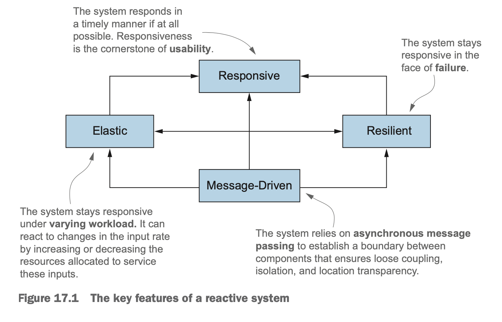
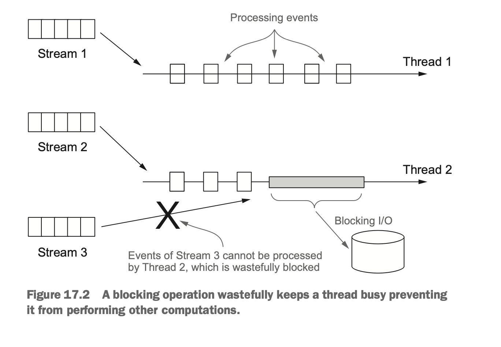

# 리액티브 프로그래밍

- 목적
  - Reactive 프로그래밍을 정의한다.
  - Reactive 매니패스토를 이해한다.
  - 애플리케이션 수준 vs 시스템 수준의 리액티브 프로그래밍
  - Java9의 Flow API 이해
  - RxJava 소개
  - 여러 Reactive 스트림을 변환하고 합치는 RxJava 동작 살펴보기
  - 마블 다이어그램 : 리액티브 스트림의 동작을 시각적으로 문서화 하기

- 리액티브 프로그래밍이 나오게 된 배경(상황)
  * 빅데이터 : 빅데이터 ~ 페타바이트(메가 < 기가 < 테라 < 페타). 매일 증가
  * 다양한 환경 : 모바일에서 부터 클라우드(수천개의 코어) 까지
  * 사용 패턴 : 사용자는 1년 내내 항상 서비스를 이용할 수 있으며 밀리초 단위로 응답시간을 기대한다.

- 리액티브 프로그래밍
  * INPUT : 다양한 시스템과 소스에서 들어오는 데이터 
  * PROCESS : 스트림을 비동기로 처리
  * OUTPUT : 합쳐서 문제를 처리

- 실제로 리액티브 패러다임에 맞게 설계된 애플리케이션은 데이터를 즉각적으로 처리해 빠른 응답성을 제공
- 한개의 시스템 뿐만 아니라 여러 컴포넌트를 구성하고 조절할 때도 **리액티브 기법**을 사용한다.
- 리액티브 기법으로 설계된 프로그램
  - 고장, 정전 같은 장애시에 대응해야 함
  - 다양한 네트워크 상태에서(속도나 품질)도 메시지 교환을 전달해야 함
  - 무거운 작업을 하고 있는 동안에도 다른 작업을 처리할 수 있어야 함(가용성)

- <p style="color:#f66">**이게 가능해 ?** : **느슨하게 결합하고, 메시지로 통신하면 다 가능해!!!**</p>


# 1. 리액티브 매니패스토

주창자 : 조나스 보너, 데이브 팔리, 롤랜드 쿤, 마틴 톰슨

- 반응성 : 빠른 응답 / 일정하고 예상 가능한 응답 시간 : 조급하고 성질급한 사용자들에 대한 대응
- 회복성 : 장애가 발생해도 응답성 보장. 
  - 여러 컴포넌트의 시간과 공간을 분리 (???)
  - 각 컴포넌트가 비동기적으로 작업을 다른 컴포넌트에 위임 -> 회복성 달성
- 탄력성 : 부하를 받게 되면 자동으로 할당된 자원 수를 늘린다.
- 메시지 드리븐 : 회복성과 탄력성을 지원하려면 
  - **약한 결합**
  - **고립**
  - **위치 투명성**




## 1.1 애플리케이션 수준의 리액티브

* 이벤트 스트림을 blocking 하지 않고 비동기로 작업을 처리하는 것이 멀티코어 CPU 환경에서 사용률을 극대화하는 방법임.
* 이 목표를 달성하기 위해 Future, Actor, Event Loop, Callback 등을 사용하는 것임.
  * 쓰레드 보다 가볍고...(?) 
  * 개발자에게도 이득 : 동기블록, 경쟁조건, 데드락 같은 문제로 고민할 필요 없이 그냥 만들어진 라이브러리를 쓰면 알아서 해결해 준다. 비즈니스 로직에 집중하고, 이런 처리는 맡겨라.
* 쓰레드를 다시 쪼개는 종류의 기술을 이용할 때는 메인 이벤트 루프 안에서는 절대 동작을 블럭하지 않아야 한다는 중요한 전제 조건이 항상 따른다....(???)

* RxJava, Akka 같은 라이브러리는 별도로 지정된 쓰레드 풀에서 블럭동작을 실행시켜 이 문제를 해결한다.
* **리액티브 시스템을 만들려면 훌륭하게 설계된 리액티브 애플리케이션 집합이 서로 잘 조화를 이루게 만들어야 한다.** : (말이야 쉽지... 예를 하나 들어 주던지... 좋은 말만 남발하는 무책임한 저자)

## 1.2 시스템 수준의 리액티브

리액티브 시스템
* 여러 애플리케이션이 한 개의 일관적인, 회복할 수 있는 플랫폼을 구성.
* 하나가 실패해도 전체 시스템은 계속 운영될 수 있도록 해주는 소프트웨어 아키텍쳐
* 애플리케이션 수준 : 
  * 처리가 비교적 짧은 시간 동안만 유지되는 데이터 스트림에 기반해 연산을 수행
  * 이벤트 주로도 구현
  * 이벤트 : 리스너로 등록한 컴포넌트가 모두 수신
* 시스템 수준 : 
  * 애플리케이션을 조립하고 상호 소통
  * 메시지 주도로 구현
  * 메시지 : 지정된 하나의 목적지를 향해 출발(발신자)... 도착(수신자). (envelop)
  * 수신자와 발신자가 각각 수신 메시지와 발신 메시지와 결합하지 않도록 메시지를 비동기로 처리 => 고립 => 회복성, 반응성, 탄력성 유지  
* 컴포넌트에서 발생한 장애를 고립시킴으로 문제가 주변의 다른 컴포넌트로 전파되면서 전체 시스템 장애로 이어지는 것을 막아서 회복성을 제공한다.
* blabla... 
* 회복성 : 고립과 비결합
* 탄력성 : 위치 투명성

# 2. 리액티브 스트림과 Flow API

## 2.1 Flow Class

아래 4개의 인터페이스로 구성된다.

- Publisher
- Subscriber
- Subscription
- Processor


## 2.2 첫번째 Reactive 애플리케이션 만들기

<a href="./application1.md"> 첫번째 애플리케이션 </a>


## 2.3 Processor 로 데이터 변환하기


## 2.4 자바는 왜 플로 API 구현을 제공하지 않는가?

API를 만들 당시 이미 Akka, RxJava 등 리액티브 스트림 기반의 Flow 라이브러리가 이미 잘 개발되어 있었기 때문에 구지 표준 방식을 따로 구현할 필요가 없었다.

# 3. RxJava : Reactive 자바 라이브러리

 넷플릭스에서 개발한 리액티브 프로그래밍 라이브러리.
 넷플릭스에서 Reactive Extension (Rx) 프로젝트의 일부로 RxJava 를 만들었다.

 RxJava 에서 Publisher 를 구현한 클래스
  * Observable : 역압력이 구현되어 있지 않은 Publisher
  * Flowable : 역압력이 구현되어 있는 Publisher 구현체
  * 선언하고 쓸 때는 Observable이나 Flowable 보다는 Publisher 인터페이스를 선언하는 것이 좋다. ( 구현체 감추기)
* RxJava 는 1000개 이하의 스트림이나, 마우스 움직임, 터치 이벤트 등은 역압력을 쓰지 말 것을 권고하고 있다. (성능이 저하된다)
* 
 

## 3.1 Observable 만들고 사용하기

RxJava의 Observable은 리액티브 스트림을 편리하게 만들어 준다.
 * Observable : Publisher
 * Observer   : Subscriber
 * Disposible : Subscription ()
```java
Observable<String> strings = Observable.just("first", "second");
...
strings.subscribe(str->System.out.println(str);
strings.subscribe(new Observer<String>() {
            @Override
            public void onSubscribe(Disposable disposable) {
                System.out.println("on subscribe");
            }

            @Override
            public void onNext(String s) {
                System.out.println("onNext : "+s);
            }

            @Override
            public void onError(Throwable throwable) {
                System.err.println("error : "+throwable);
            }

            @Override
            public void onComplete() {
                System.out.println("complete");
            }
        });
```
output
```
first
second
on subscribe
onNext : first
onNext : second
complete
```

이벤트 방출 속도를 제어하는 방법..
```
Observable<Long> onePerSec = Observable.interval(1, TimeUnit.SECONDS);

// 방법1
onePerSec.subscribe(i -> System.out.println(TempInfo.fetch("뉴욕")));

// 방법2 : 메인이 끝나더라도 쓰레드가 끝날 때까지 기다려 준다.
onePerSec.blockingSubscribe(
  i -> System.out.println(TempInfo.fetch("뉴욕"))
)

// output
뉴욕 : 87
```


Observer 인터페이스
```java
public interface Observer<T> {
  void onSubscribe(Disposible d);
  void onNext(T t);
  void onError(Throwable t);
  void onComplete(); 
}
```

Java9의 Flow와 차이점
* Observer에 onNext만 구현한 람다를 줄 수 있다.
* 

<a href="./application2.md"> 두번째 애플리케이션 </a>

## 3.2 Akka

<a href="./application3.md"> 세번째 애플리케이션 </a>

