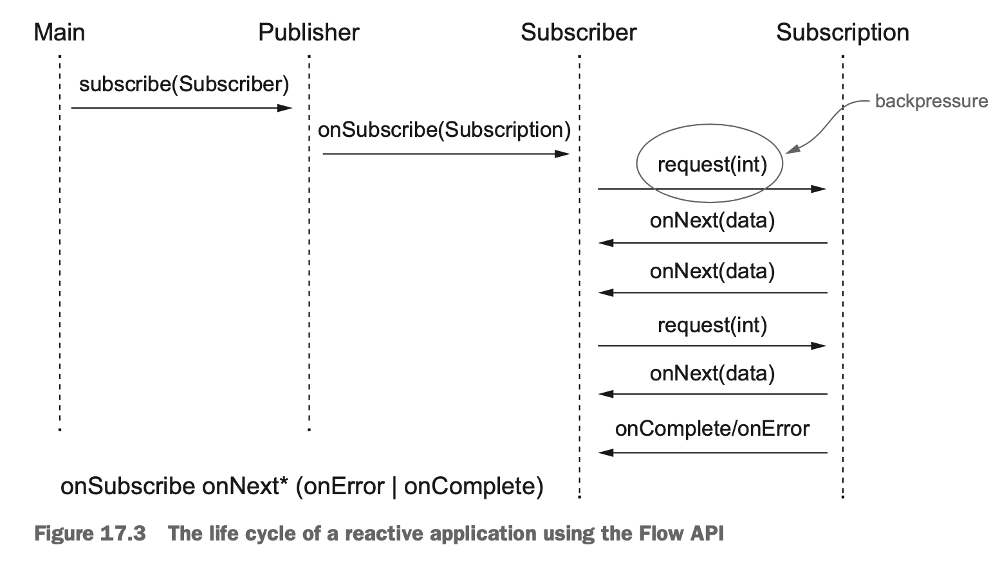

플로 API를 사용하는 리액티브 애플리케이션의 생명주기



이벤트가 호출되는 순서
```
onSubscribe onNext* (OnError | OnComplete)?
```

* 질문) onSubscribe 만 호출되면 어떻게 될까?
* 의견) 전통적인 pub-sub 구조라면 publisher 가 발행한 것을 subscriber가 구독하는 형태인데, 이 구조는 Subscription 이 마치 큐의 이벤트를 소비하는 publisher 가 되어 활동하는 것 같다.

TempInfo : 특정 지역의 현재 기온을 알려주는 데이터 객체.

```java
import lombok.Builder;
import lombok.Data;

import java.util.Random;

@Data
@Builder
public class TempInfo {

    private static final Random random = new Random();

    private final String town;
    private final int temp;

    public TempInfo(String town, int temp) {
        this.town = town;
        this.temp = temp;
    }

    public static TempInfo fetch(String town){
        if(random.nextInt(10) == 0)
            throw new RuntimeException("Error!");
        return TempInfo.builder()
                .town(town)
                .temp(random.nextInt(100))
                .build();
    }

}
```

subsriber : 
  * 해당 지역의 기온을 구독하는 객체.
  * 현재 온도를 받으면 출력하고 곧바로 다음 기온을 달라는 요청을 보낸다.
  * 에러가 발생하면 더 이상 기온을 받지 않고 끝낸다.
```java

import java.util.concurrent.Flow.*;

public class TempSubscriber implements Subscriber<TempInfo> {

    private Subscription subscription;

    @Override
    public void onSubscribe(Subscription subscription) {
        this.subscription = subscription;
        subscription.request(1);
    }

    @Override
    public void onNext(TempInfo tempInfo) {
        System.out.println(tempInfo);
        subscription.request(1);
    }

    @Override
    public void onError(Throwable throwable) {
        System.err.println(throwable.getMessage());
    }

    @Override
    public void onComplete() {
        System.out.println("All Done!!!");
    }
}

```

TempSubscription 
  * 요청하면 바로 다음 기온을 보낸다.
  * 만약 request 에 2이상을 보내면 ... 기하급수적으로 처리 쓰레드가 늘어난다.
  * 이 예제는 매우 좋지 않은 사용 예라고 생각한다.
```java

import java.util.concurrent.Flow.*;

public class TempSubscription implements Subscription {

    private final Subscriber<? super TempInfo> subscriber;
    private final String town;

    public TempSubscription(Subscriber<? super TempInfo> subscriber, String town) {
        this.subscriber = subscriber;
        this.town = town;
    }

    @Override
    public void request(long n) {
        for(long i=0;i<n;i++){
            try{
                subscriber.onNext(TempInfo.fetch(this.town));
            }catch(Exception ex){
                subscriber.onError(ex);
                break;
            }
        }
    }

    @Override
    public void cancel() {
        subscriber.onComplete();
    }
}
```
실행
```java
import java.util.concurrent.Flow.*;

public class TestMain {

    public static void main(String[] args) {
        getTemperature("New York").subscribe(new TempSubscriber());
    }

    private static Publisher<TempInfo> getTemperature(String town) {
        return s->s.onSubscribe(new TempSubscription(s, town));
    }
    
}
```

실행 결과 
```
TempInfo(town=New York, temp=67)
TempInfo(town=New York, temp=90)
TempInfo(town=New York, temp=30)
TempInfo(town=New York, temp=0)
TempInfo(town=New York, temp=86)
TempInfo(town=New York, temp=98)
Error!

```