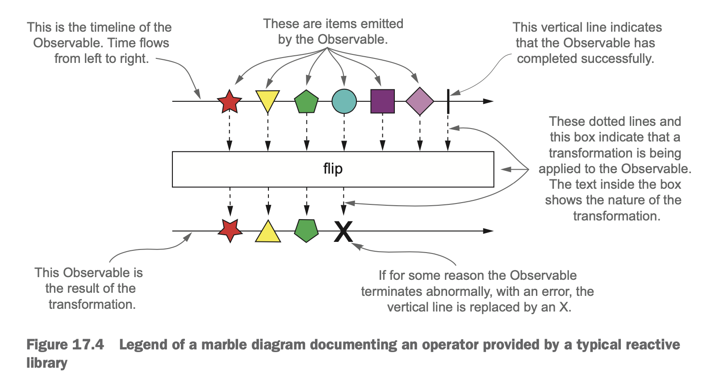

TemperatureObservable
```java
mport static java.util.stream.Collectors.toList;

import java.util.Arrays;
import java.util.concurrent.TimeUnit;

import io.reactivex.Observable;
import modernjavainaction.chap17.impl.TempInfo;

public class TempObservable {

    public static Observable<TempInfo> getTemperature(String town) {
        return Observable.create(emitter -> Observable.interval(1, TimeUnit.SECONDS).subscribe(i -> {
            if (!emitter.isDisposed()) {
                if (i >= 5) {
                    emitter.onComplete();
                } else {
                    try {
                        emitter.onNext(TempInfo.fetch(town));
                    } catch (Exception e) {
                        emitter.onError(e);
                    }
                }
            }
        }));
    }

    public static Observable<TempInfo> getCelsiusTemperature(String town) {
        return getTemperature(town)
                .map(temp -> new TempInfo(temp.getTown(), (temp.getTemp() - 32) * 5 / 9));
    }

    public static Observable<TempInfo> getNegativeTemperature(String town) {
        return getCelsiusTemperature(town)
                .filter(temp -> temp.getTemp() < 0);
    }

    public static Observable<TempInfo> getCelsiusTemperatures(String... towns) {
        return Observable.merge(Arrays.stream(towns)
                .map(TempObservable::getCelsiusTemperature)
                .collect(toList()));
    }

}
```

TemperatureObserver

```java
import io.reactivex.Observer;
import io.reactivex.disposables.Disposable;
import modernjavainaction.chap17.impl.TempInfo;

public class TempObserver implements Observer<TempInfo> {

    @Override
    public void onComplete() {
        System.out.println("Done!");
    }

    @Override
    public void onError(Throwable throwable) {
        System.out.println("Got problem: " + throwable.getMessage());
    }

    @Override
    public void onSubscribe(Disposable disposable) {
    }

    @Override
    public void onNext(TempInfo tempInfo) {
        System.out.println(tempInfo);
    }

}
```


메인 실행 클래스
```java
import static modernjavainaction.chap17.rxjava.TempObservable.getTemperature;

import io.reactivex.Observable;
import modernjavainaction.chap17.impl.TempInfo;

public class Main {

    public static void main(String[] args) {
        Observable<TempInfo> observable = getTemperature("New York");
        observable.subscribe(new TempObserver());

        try {
            Thread.sleep(10000L);
        } catch (InterruptedException e) {
            throw new RuntimeException(e);
        }
    }

}
```





```java
import static modernjavainaction.chap17.rxjava.TempObservable.getCelsiusTemperatures;

import io.reactivex.Observable;
import modernjavainaction.chap17.impl.TempInfo;

public class MainCelsius {

    public static void main(String[] args) {
        Observable<TempInfo> observable = getCelsiusTemperatures("New York", "Chicago", "San Francisco");
        observable.subscribe(new TempObserver());

        try {
            Thread.sleep(10000L);
        } catch (InterruptedException e) {
            throw new RuntimeException(e);
        }
    }

}
```

